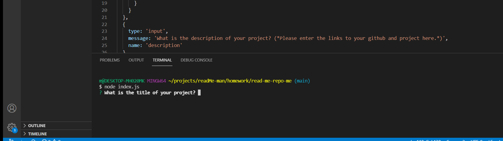

# Read Me Generator Lite

## Description 

This application is built to create a professional read me using node and the command line. Upon opening the application you will be presented with a series of prompts that follow the layout of a read me. When prompted with certain questions, if the answer is no, them the question is passed over with either placeholder text or is left blank. When the prompt for a license is presented, if the user is using one, they are presented with 3 options and when one is selected a license is rendered along with an accompanying badge. Once the prompts are completed, a read me is created along with a table of contents that will direct you to their respective sections upon clicking. Github: https://github.com/michaelab24/read-me-repo-me

## Table of Contents
* [Installation](#installation)
* [Usage](#usage)
* [Credits](#credits)
* [Licenses](#license)
* [Badges](#badges)
* [Features](#features)
* [Contributors](#contributors)
* [Test](#test)

## Installation

You must open the index.js file and run your terminal. Direct yourself to the repository "read-me-repo-me" and run node index.js in order to be presented with the prompts.

## Usage 

Once you are in the terminal and run node. You will fill out all of the sections that correspond with your particular project. Here is a screenshot of what your first prompt will look like. 

## Credits

None

## License

Community license to be defined

## Badges

## Features

No extra features

## Contributors

None

## Test

Screencastify to be attached to project submission.

## Questions

michaelbarnes459@yahoo.com
